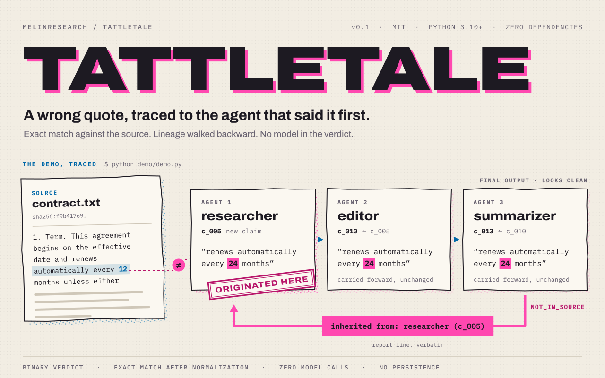
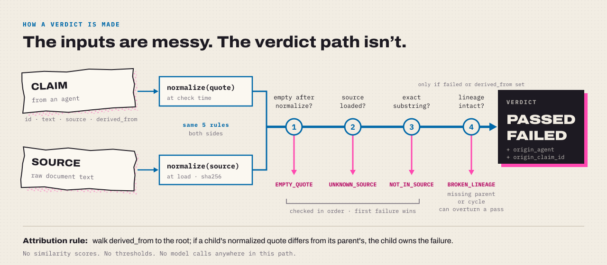

<picture>
  <source media="(prefers-color-scheme: dark)" srcset="assets/tattletale-hero-dark.svg">
  
</picture>

<p>
  <a href="https://github.com/MeLinResearch/tattletale/actions/workflows/ci.yml"></a>
  
  
  <a href="LICENSE"></a>
</p>

In a multi-agent pipeline, agent A quotes a document. Agent B carries the quote
forward. Agent C summarizes B. If the quote was invented, all three handled it
and none of them checked. The final output looks clean.

**Tattletale checks every quoted span against the source, exactly. When one
isn't there, it names the agent that introduced it, not the agent that last
repeated it.**

It verifies quotation, not truth. That is a smaller promise than it sounds, and
it is the only one that can be kept deterministically.

## Quickstart

```bash
pip install git+https://github.com/MeLinResearch/tattletale
```

```python
from tattletale import Claim, Monitor

tt = Monitor({"contract.txt": contract_text})

tt.check("researcher", [Claim("c_005", "renews automatically every 24 months", "contract.txt")])
tt.check("editor",     [Claim("c_010", "renews automatically every 24 months", "contract.txt", derived_from="c_005")])

print(tt.report())
```

Three methods are the whole library: `Monitor(sources)`, `check(agent, claims)`,
`report(format="text" | "json")`.

## The demo

`make demo` runs a three-agent pipeline over a sample contract with one planted
fabrication. This is the unedited output:

```
TATTLETALE    13 claims     3 failed
source: contract.txt       sha256:f9b41769fde320e7c71234d1c05d747dd599b7a9b2e32352b3bd4c2df9fe0276 (normalized)

researcher          5 claims     1 FAILED
  c_005     "renews automatically every 24 months"
            NOT_IN_SOURCE
            originated here

editor          5 claims     1 FAILED
  c_010     "renews automatically every 24 months"
            NOT_IN_SOURCE
            inherited from: researcher (c_005)

summarizer          3 claims     1 FAILED
  c_013     "renews automatically every 24 months"
            NOT_IN_SOURCE
            inherited from: researcher (c_005)
```

`report(format="json")` gives the same content as a deterministic record:
summary counts, normalized source hashes, per-agent counts, and every passing
and failing claim with its lineage fields.

## How a verdict is made

<picture>
  <source media="(prefers-color-scheme: dark)" srcset="assets/tattletale-verdict-dark.svg">
  
</picture>

| Code             | Fails when                                                        |
| ---------------- | ----------------------------------------------------------------- |
| `EMPTY_QUOTE`    | The quote is empty after normalization                            |
| `UNKNOWN_SOURCE` | The claim names a document that was never loaded                  |
| `NOT_IN_SOURCE`  | The normalized quote is not an exact substring of the source      |
| `BROKEN_LINEAGE` | `derived_from` points at an unchecked claim, or the chain cycles  |

Every failure gets exactly one code. The first three are checked in that order
and the first failure wins. Lineage runs only on claims that failed or carry
`derived_from`, and it can overturn a pass.

**Who gets blamed.** The walk follows `derived_from` to the root. If an agent
carries a quote forward unchanged, blame passes upstream. If an agent rewords a
quote and the reworded version fails, that agent owns it: a modified quote is a
new claim.

## Design constraints

- **Binary.** A quote is in the normalized source or it is not. No similarity
  scores, no thresholds, nothing to tune or argue with.
- **Normalize identically, compare exactly.** Source and quote get the same five
  rules: NFKC, quote straightening, soft-hyphen and line-break repair,
  whitespace collapse, trim. No case folding, no stemming, no fuzzy matching.
- **No model in the verdict path.** String comparison and a dictionary walk.
  The optional `tattletale.extract.quoted_spans` helper pulls quoted spans out
  of free text; it is best-effort and never affects a verdict.
- **Zero runtime dependencies. No persistence.** A `Monitor` lives for one run.

Not checked, on purpose: whether the claim is true, whether the quote supports
it, whether the agent picked a relevant passage.

Full specification, data model and edge cases: [ARCHITECTURE.md](ARCHITECTURE.md).

## Development

```bash
make setup   # editable install with dev extras
make test    # pytest, including the adversarial suite
make demo    # the three-agent pipeline above
```

```
src/tattletale/
  models.py      Claim / ClaimResult, reason codes        spec §3, §5.2
  normalize.py   normalization + source hashing           spec §5.1
  monitor.py     the three-method API                     spec §4
  lineage.py     origin walk: missing parent, cycle,
                 reworded quote                           spec §6
  report.py      text and JSON renderers                  spec §7
  extract.py     optional best-effort quote extractor     spec §4
tests/           one file per build step; adversarial suite is step 8
demo/            three agents, one contract, one planted fabrication
assets/build/    generator for the README artwork
```

The README artwork is generated by
[`assets/build/build_art.py`](assets/build/build_art.py). All text is converted
to paths, so it renders the same everywhere, and the hero shows the real demo
output.

## License

[MIT](LICENSE)
